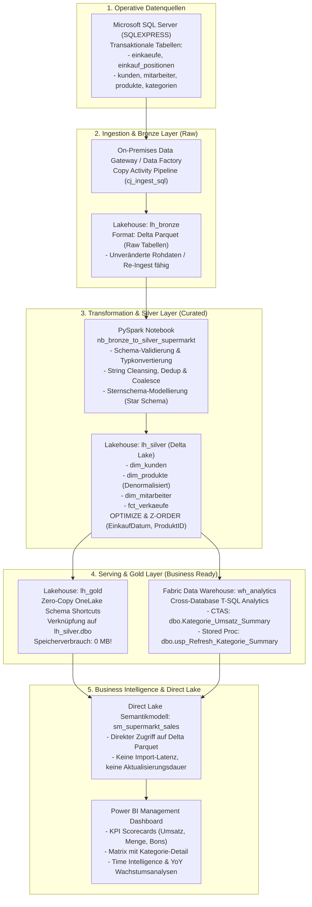

# 🛒 Supermarkt Medallion Data Platform & Power BI Direct Lake
### End-to-End Enterprise Lakehouse on Microsoft Fabric (DP-700 & PL-300)

[](https://learn.microsoft.com/fabric/)
[](https://spark.apache.org/)
[](https://learn.microsoft.com/sql/t-sql/)
[](https://powerbi.microsoft.com/)
[](LICENSE)

---

## 📌 Übersicht & Geschäftskontext

Dieses Repository beinhaltet die vollständige, produktionsreife Implementierung einer modernen **Cloud Data Platform** für den Einzelhandel (Supermarkt-Filialen & E-Commerce).

Ziel ist es, transaktionale Kassensysteme und ERP-Daten über eine dreistufige **Medallion-Architektur (Bronze ➔ Silver ➔ Gold)** in **Microsoft Fabric** zu überführen, mittels **PySpark** und **Delta Lake** zu bereinigen und über **Power BI Direct Lake** ohne Duplikation oder ETL-Latenz für das Management bereitzustellen.

---

## 🏗️ End-to-End Architektur



---

## 📂 Repository-Struktur

```text
├── notebooks/
│   └── nb_bronze_to_silver_supermarkt.py   # PySpark ETL: Cleansing, Star Schema & Delta Z-Order
├── sql_warehouse/
│   └── warehouse_analytics_ctas_sp.sql     # Fabric Data Warehouse CTAS & Stored Procedures
├── power_bi/
│   └── dax_measures_supermarkt.dax         # Explizite DAX Measures (Time Intelligence, YoY, KPIs)
├── .gitignore
└── README.md                               # Vollständige Dokumentation & Runbook
```

---

## 🛠️ Technische Kernkomponenten

### 1. PySpark & Delta Lake (Bronze ➔ Silver)
*Datei:* [`notebooks/nb_bronze_to_silver_supermarkt.py`](notebooks/nb_bronze_to_silver_supermarkt.py)
- **Denormalisierung:** Automatisches Auflösen von hierarchischen Kategorien in `dim_produkte` für das Sternschema.
- **Datenhygiene:** Bereinigung von Leerzeichen (`trim`), Nullwert-Absicherung (`coalesce`) und deterministische Deduplizierung über Primärschlüssel.
- **Faktentabellen-Generierung:** Verknüpfung von Belegkopf und Positionen, Berechnung von Umsatzkennzahlen und automatisches Extrahieren von Datumsdimensionen (`Jahr`, `Monat`, `Wochentag`).
- **Performance-Tuning:** Anwendung von `OPTIMIZE` mit multidimensionalem `Z-ORDER BY (EinkaufDatum, ProduktID)` für beschleunigtes File-Skipping bei analytischen Abfragen.

### 2. Fabric Synapse Data Warehouse (T-SQL CTAS)
*Datei:* [`sql_warehouse/warehouse_analytics_ctas_sp.sql`](sql_warehouse/warehouse_analytics_ctas_sp.sql)
- **Cross-Database Abfragen:** Nahtlose SQL-Abfragen über den Lakehouse-Shortcut (`[lh_silver].[dbo].[fct_verkaeufe]`).
- **CTAS (CREATE TABLE AS SELECT):** Performante Vorberechnung aggregierter Datamarts für schnelle Executive-Reports.
- **Idempotente Stored Procedures:** Automatisiertes Leeren (`TRUNCATE`) und Wiederbefüllen via `dbo.usp_Refresh_Kategorie_Summary`.

### 3. Power BI Direct Lake & DAX
*Datei:* [`power_bi/dax_measures_supermarkt.dax`](power_bi/dax_measures_supermarkt.dax)
- **Direct Lake Modus:** Direkte Abfrage der Delta Parquet Dateien in OneLake ohne herkömmlichen Datenimport und ohne DirectQuery-Performanceverluste.
- **Explizite DAX Measures:**
  - `Total_Umsatz = SUM(fct_verkaeufe[Gesamtbetrag])`
  - `Durchschnittsbon = DIVIDE([Total_Umsatz], [Anzahl_Transaktionen], 0)`
  - `Total_Umsatz_Vorjahr = CALCULATE([Total_Umsatz], SAMEPERIODLASTYEAR('dim_datum'[Datum]))`
  - `Umsatz_YoY_Wachstum_% = DIVIDE([Umsatz_YoY_Wachstum_Absolut], [Total_Umsatz_Vorjahr], 0)`

---

## 🚀 Schritt-für-Schritt Runbook (Reproduktion)

1. **Workspace anlegen:** Microsoft Fabric Workspace mit Fabric- oder Trial-Kapazität erstellen (`DP700_Supermarkt_Practice`).
2. **Lakehouses initialisieren:**
   - `lh_bronze`: Speicherort für unveränderte Rohdaten.
   - `lh_silver`: Bereinigter Delta Lake Layer.
   - `lh_gold`: Business-Layer (Zero-Copy Shortcuts auf `lh_silver`).
3. **Warehouse anlegen:** `wh_analytics` für T-SQL Serving und Cross-DB CTAS.
4. **Notebook ausführen:** `notebooks/nb_bronze_to_silver_supermarkt.py` im Fabric-Arbeitsbereich importieren und ausführen.
5. **Warehouse Skript deployen:** `sql_warehouse/warehouse_analytics_ctas_sp.sql` ausführen und Stored Procedure testen.
6. **Semantikmodell konfigurieren:** Neues Direct Lake Modell auf `lh_gold` erstellen und DAX-Measures hinterlegen.
7. **Dashboard bereitstellen:** Power BI Management Dashboard mit KPI Scorecards, Treemaps und Monatsvergleichen publizieren.

---

## 👤 Entwickler

**Alexander Fritzler**  
*Data Analyst & Microsoft Fabric Data Engineer*  
- 💼 LinkedIn: [Alexander Fritzler | Profil anzeigen](https://www.linkedin.com/in/alexander-fritzler-214628356/)  
- 🐙 GitHub: [@alefritz19](https://github.com/alefritz19)  
- 📧 Kontakt: alefritz19@gmail.com
